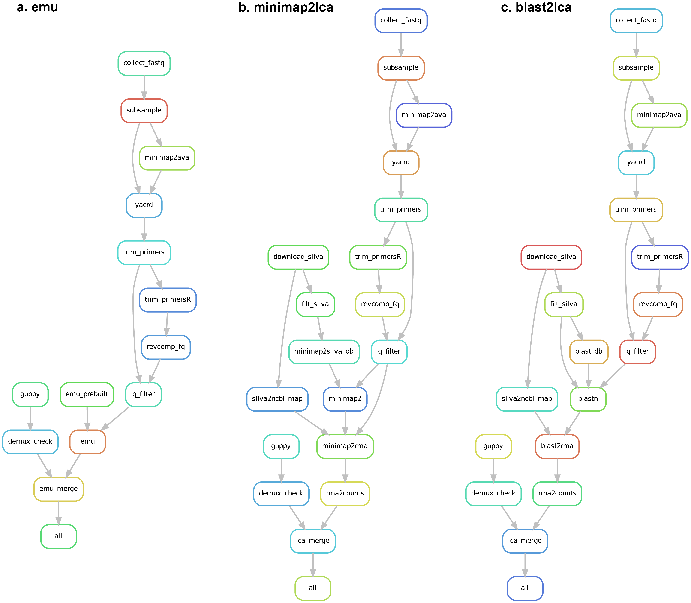

<h1 align="center">A tool for <br> Nanopore Amplicon Real-Time (NART) analysis</h1>

[](https://snakemake.bitbucket.io)
[](https://github.com/yanhui09/nart/actions?query=branch%3Amain+workflow%3ACI)

`NART` is desgined for mapping-based Nanopore Amplicon (**Real-Time**) analysis, e.g., 16S rRNA gene.
`NART` utils are composed of `nart` (Nanopore Amplicon Real-Time entry) and `nawf` (Nanopore Amplicon `snakemake` WorkFlow entry) in one python package.
`NART` provides an (real-time) end-to-end solution from bascecalled reads to the final count matrix through mapping-based strategy.

**Important: `NART` is under development, and here released as a preview. 
`NART` is only tested in Linux systems, i.e., Ubuntu.**


[Demo video on Youtube](https://www.youtube.com/watch?v=TkdJGLOscPg)

# DAG workflow
`nawf` provide three options (i.e., `emu`, `minimap2lca` and `blast2lca`) to determine microbial composition.


# Installation
[Conda](https://docs.conda.io/projects/conda/en/latest/user-guide/install/index.html) is the only required dependency prior to installation.
[Miniconda](https://docs.conda.io/en/latest/miniconda.html) is enough for the whole pipeline. 

1. Clone the Github repository and create an isolated `conda` environment
```
git clone https://github.com/yanhui09/nart.git
cd nart
conda env create -n nart -f env.yaml 
```
You can speed up the whole process if [`mamba`](https://github.com/mamba-org/mamba) is installed.
```
mamba env create -n nart -f env.yaml 
```
2. Install `NART` with `pip`
      
To avoid inconsistency, we suggest installing `NART` in the above `conda` environment
```
conda activate nart
pip install --editable .
```
At this moment, `NART` uses `guppy` or `minibar` for custom barcode demultiplexing (in our lab).<br>
**Remember to prepare the barcoding files in `guppy` or `minibar` if new barcodes are introduced.** [Click me](nart/workflow/resources/README.md)

# Quick start
## Amplicon analysis in single batch
`nawf` can be used to profile any single basecalled `fastq` file from a Nanopore run or batch.
```
conda activate nart                                            # activate required environment 
nawf config -b /path/to/basecall_fastq -d /path/to/database    # init config file and check
nawf run all                                                   # start analysis
```

## Real-time analysis
`nart` provide utils to record, process and profile the continuously generated `fastq` batch.

Before starting real-time analysis, you need `nawf` to configure the workflow according to your needs. 
```
conda activate nart                                            # activate required environment 
nawf config -b /path/to/basecall_fastq -d /path/to/database    # init config file and check
```

In common cases, you need three independent sessions to handle monitor, process and visulization, repectively.
1. Minitor the bascall output and record
```
conda activate nart                                            # activate required environment 
nart monitor -q /path/to/basecall_fastq_dir                    # monitor basecall output
```
2. Start amplicon analysis for new fastq
```
conda activate nart                                            # activate required environment 
nart run -t 10                                                 # real-time process in batches
```
3. Update the feature table for interactively visualize in the browser
```
conda activate nart                                            # activate required environment 
nart visual                                                    # interactive visualization
```

# Usage
`NART` is composed of two sets of scripts: `nart` and `nawf`, which controls real-time analysis and workflow performance, respectively.

## nart
```
Usage: nart [OPTIONS] COMMAND [ARGS]...

  NART: A tool for Nanopore Amplicon Real-Time (NART) analysis. To follow
  updates and report issues, see: https://github.com/yanhui09/nart.

Options:
  -v, --version  Show the version and exit.
  -h, --help     Show this message and exit.

Commands:
  monitor  Start NART to monitor a directory.
  run      Start NART workflow.
  visual   Start NART app to interactively visualize the results.
```

```
Usage: nart monitor [OPTIONS]

  Start NART monitor.

Options:
  -q, --query PATH       A query directory to monitor the new fastq files.
  -e, --extension TEXT   The file extension to monitor for (e.g. '.fastq').
                         [default: .fastq]
  -w, --workdir PATH     Workflow working directory.  [default: .]
  -t, --timeout INTEGER  Stop query if no new files were generated within the
                         give minutes.  [default: 30]
  -h, --help             Show this message and exit.
```

```
Usage: nart run [OPTIONS] [SNAKE_ARGS]...

  Start NART.

Options:
  -w, --workdir PATH     Workflow working directory.  [default: .]
  -t, --timeout INTEGER  Stop run if no new files were updated in list within
                         the given minutes.  [default: 10]
  -c, --configfile FILE  Workflow config file. Use config.yaml in working
                         directory if not specified.
  -j, --jobs INTEGER     Maximum jobs to run in parallel.  [default: 6]
  -m, --maxmem FLOAT     Specify maximum memory (GB) to use. Memory is
                         controlled by profile in cluster execution.
  --profile TEXT         Snakemake profile for cluster execution.
  -n, --dryrun           Dry run.
  -h, --help             Show this message and exit.
```

```
Usage: nart visual [OPTIONS]

Options:
  -p, --port INTEGER       Port to run the app on.  [default: 5000]
  -i, --input PATH         Path to the working directory.  [default: .]
  -w, --wait-time INTEGER  Time to wait (in minutes) if input file is missing.
                           [default: 5]
  --relative               Use relative abundance instead of absolute
                           abundance.
  --rm-unmapped            Remove unmapped reads from the table.
  --min-abundance INTEGER  Minimum absolute abundance of a feature to plot.
                           [default: 1]
  -h, --help               Show this message and exit.
```

## nawf
```
Usage: nawf [OPTIONS] COMMAND [ARGS]...

  NAWF: A sub-tool to run Nanopore Amplicon WorkFlow. The workflow command
  initiates the NAWF in a single batch, using either a fastq file from one ONT
  run or a fastq file generated during sequencing. To follow updates and
  report issues, see: https://github.com/yanhui09/nart.

Options:
  -v, --version  Show the version and exit.
  -h, --help     Show this message and exit.

Commands:
  config  Generate the workflow config file.
  run     Start workflow in a single batch.
```

```
Usage: nawf config [OPTIONS]

  Config NAWF.

Options:
  -b, --bascfq PATH               Path to a basecalled fastq file. Option is
                                  required if 'demuxdir' not provided. Option
                                  is mutually exclusive with 'demuxdir'.
  -x, --demuxdir PATH             Path to a directory of demultiplexed fastq
                                  files. Option is required if 'bascfq' not
                                  provided. Option is mutually exclusive with
                                  'bascfq'.
  -d, --dbdir PATH                Path to the taxonomy databases.  [required]
  -w, --workdir PATH              Output directory for NAWF.  [default: .]
  --demuxer [guppy|minibar]       Demultiplexer.  [default: guppy]
  --fqs-min INTEGER               Minimum number of reads for the
                                  demultiplexed fastqs.  [default: 50]
  --subsample                     Subsample the reads.
  --trim                          Trim primers.
  --classifier [emu|minimap2lca|blast2lca]
                                  Classifier.  [default: emu]
  --jobs-min INTEGER              Number of jobs for common tasks.  [default:
                                  2]
  --jobs-max INTEGER              Number of jobs for threads-dependent tasks.
                                  [default: 6]
  -h, --help                      Show this message and exit.
```

```
Usage: nawf run [OPTIONS] {init|demux|qc|all} [SNAKE_ARGS]...

  Run NAWF in a single batch.

Options:
  -w, --workdir PATH     Workflow working directory.  [default: .]
  -c, --configfile FILE  Workflow config file. Use config.yaml in working
                         directory if not specified.
  -j, --jobs INTEGER     Maximum jobs to run in parallel.  [default: 6]
  -m, --maxmem FLOAT     Specify maximum memory (GB) to use. Memory is
                         controlled by profile in cluster execution.
  --profile TEXT         Snakemake profile for cluster execution.
  -n, --dryrun           Dry run.
  -h, --help             Show this message and exit.
```
